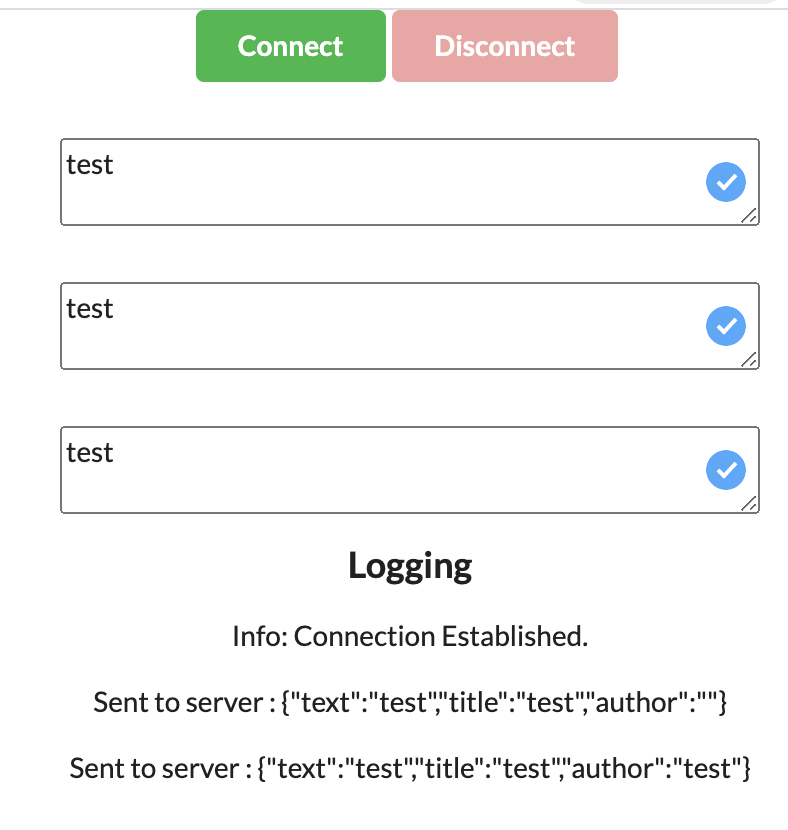

# Spring Webflux Example:

Simple example of using spring web flux (REST + WebSockets)

Run - mvn spring-boot:run

    REST ENDPOINTS

    GET         /get/{id}
    POST        /save
    DELETE      /delete/{id}
    GET         /get/all
 

WebSocket (WebSocketHandler) navigate here http://localhost:8080/index.html

